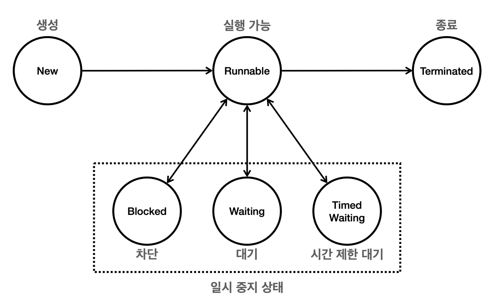

### 스레드의 생명주기

- New (새로운 상태): 스레드가 생성되었으나 아직 시작되지 않은 상태. 
- Runnable (실행 가능 상태): 스레드가 실행 중이거나 실행될 준비가 된 상태.
- 일시 중지 상태들 (Suspended States)
  - Blocked (차단 상태): 스레드가 동기화 락을 기다리는 상태.
  - Waiting (대기 상태): 스레드가 무기한으로 다른 스레드의 작업을 기다리는 상태.
  - Timed Waiting (시간 제한 대기 상태): 스레드가 일정 시간 동안 다른 스레드의 작업을 기다리는 상태.
- Terminated (종료 상태): 스레드의 실행이 완료된 상태.

> "차단 / 대기 / 시간 제한 대기" 의 경우는 실제 CPU 의  실행 스케줄러에 들어가지 않는다.  
> 오직 Runnable 상태가 되어야 CPU 의 실행 스케줄러에 들어가고.  
> 그래야 거기서 싫제 CPU 에 의해서 RUNNING 이 될수있고, 스케줄러의 대기 QUEUE 에서 Ready 상태로 기다릴 수도 있는것이다.