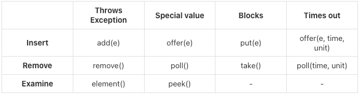

### BlockingQueue - 기능 설명
실무에서 multiThread 를 사용할때는 응답성이 매우 중요하다.  
예를들어, 대기 상태에 있어도 고객에게 중지요청 들어온다.   너무 오래걸리면 대기하고 빠져 나갈 수 있다는것이다.   생산자가 데이터를 생성하려고 하는데, 버퍼가 빠지지 않아서 너무 오래 대기 해야한다.  
그러면 무한정 로딩바가 돌면서 고객의 불편사항이 생기게 되고   시스템 공지를 해야한다. ex) 나중에 다시 시도해 달라고 하거나.

### 큐가 가득찼을때 어떻게 해야하는가.
- 예외를 던진다. 예외를 받아서 처리한다.
- 대기하지 않는다. 즉시 false 를 반환한다.
- 대기한다.
- 특정 시간 만큼만 대기한다.

> 이러한 문제를 해결하기 위해 BlockingQueue 는 각 상황에 맞는 다양한 메서드를 제공한다.

### BlockingQueue 의 다양한 기능 - 공식 API 문서

### Throws Exception - 대기시 예외
- add(e): 지정된 요소를 큐에 추가하며, 큐가 가득 차면 IllegalStateException 예외를 던진다.
- remove(): 큐에서 요소를 제거하며 반환한다. 큐가 비어 있으면 NoSuchElementException 예외를 던진 다.
- element(): 큐의 머리 요소를 반환하지만, 요소를 큐에서 제거하지 않는다. 큐가 비어 있으면 NoSuchElementException 예외를 던진다.

### Special Value - 대기시 즉시 반환
- offer(e): 지정된 요소를 큐에 추가하려고 시도하며, 큐가 가득 차면 false 를 반환한다.
- poll(): 큐에서 요소를 제거하고 반환한다. 큐가 비어 있으면 null 을 반환한다.
- peek(): 큐의 머리 요소를 반환하지만, 요소를 큐에서 제거하지 않는다. 큐가 비어 있으면 null 을 반환한다.

### Blocks - 대기
- put(e): 지정된 요소를 큐에 추가할 때까지 대기한다. 큐가 가득 차면 공간이 생길 때까지 대기한다.
- take(): 큐에서 요소를 제거하고 반환한다. 큐가 비어 있으면 요소가 준비될 때까지 대기한다.
- Examine (관찰): 해당 사항 없음.

### Times Out - 시간 대기
- offer(e, time, unit): 지정된 요소를 큐에 추가하려고 시도하며, 지정된 시간 동안 큐가 비워지기를 기다리다가 시간이 초과되면 false 를 반환한다.
- poll(time, unit): 큐에서 요소를 제거하고 반환한다. 큐에 요소가 없다면 지정된 시간 동안 요소가 준비되기를 기다리다가 시간이 초과되면 null 을 반환한다.
- Examine (관찰): 해당 사항 없음.